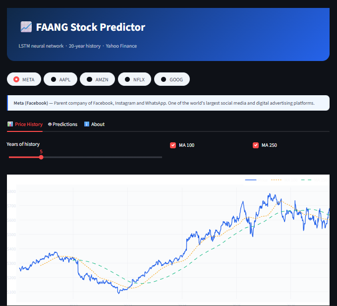

# 📈 FAANG Stock Predictor

An LSTM-powered stock price predictor for **META, AAPL, AMZN, NFLX & GOOG**, built with Streamlit. Pulls 20 years of price history live from Yahoo Finance and compares actual vs. predicted closing prices against a naive baseline.

**🔗 Live app:** [faangcast.streamlit.app](https://faangcast.streamlit.app)

## Screenshots

<!-- screenshots below -->


## Features

- Live 20-year price history for 5 FAANG companies
- LSTM neural network predictions vs. actual prices, with RMSE benchmarking
- Adjustable time range, moving averages (MA100 / MA250)
- Fully responsive — works on desktop, tablet, and mobile

## Tech stack

- **Streamlit** — web app framework
- **TensorFlow / Keras** — LSTM model training & inference
- **yfinance** — live stock data
- **Plotly** — interactive charts
- **scikit-learn** — data scaling

## Running locally

```bash
git clone https://github.com/5hir-shoT/stock-predictor-v1.git
cd stock-predictor-v1
python -m venv venv
venv\Scripts\Activate.ps1   # Windows PowerShell
pip install -r requirements.txt
streamlit run app.py
```

## Disclaimer

This app is for **educational purposes only** and should not be used for real financial decisions. Stock prices are inherently unpredictable, and this model's predictions carry no guarantee of accuracy.
